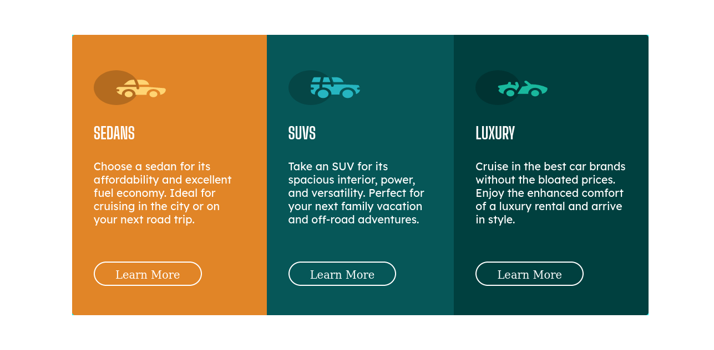

# Frontend Mentor - 3-column preview card component solution

This is a solution to the [3-column preview card component challenge on Frontend Mentor](https://www.frontendmentor.io/challenges/3column-preview-card-component-pH92eAR2-). Frontend Mentor challenges help you improve your coding skills by building realistic projects. 

## Table of contents

- [Frontend Mentor - 3-column preview card component solution](#frontend-mentor---3-column-preview-card-component-solution)
  - [Table of contents](#table-of-contents)
  - [Overview](#overview)
    - [The challenge](#the-challenge)
    - [Screenshot](#screenshot)
    - [Links](#links)
  - [My process](#my-process)
    - [Built with](#built-with)
    - [What I learned](#what-i-learned)
    - [Continued development](#continued-development)
  - [Author](#author)
  - [Acknowledgments](#acknowledgments)

## Overview

This project for the aim to practice what i learn on online courses about  HTML and CSS, its a project from **Frontend Mentor** which is website help you improve your coding skills by building real projects, solving real-world HTML, CSS and JavaScript challenges whilst working to professional designs.

### The challenge

Users should be able to:

- View the optimal layout depending on their device's screen size
- See hover states for interactive elements

### Screenshot

### Links

- Live Site URL: [https://tariqelb.github.io/Preview-card/](https://tariqelb.github.io/Preview-card/)

## My process

### Built with

- Semantic HTML5 markup
- CSS custom properties
- Flexbox
- CSS Grid
- Mobile-first workflow

### What I learned

In this chalenge i improve my skills in responsive desgin, Flexbox and CSS Grid.

### Continued development

I think responsive desgin that work in different browser needs more work for me, so i will focus on that in futur projects

## Author

- Facebook - [Tariq El bouhali](https://www.facebook.com/tariqelbouhali)

## Acknowledgments

I so grateful to Frontend Mentor for all projects, challenges and the wide community  providing for us, it's really environment where we can improve our knowledge on frontend field
